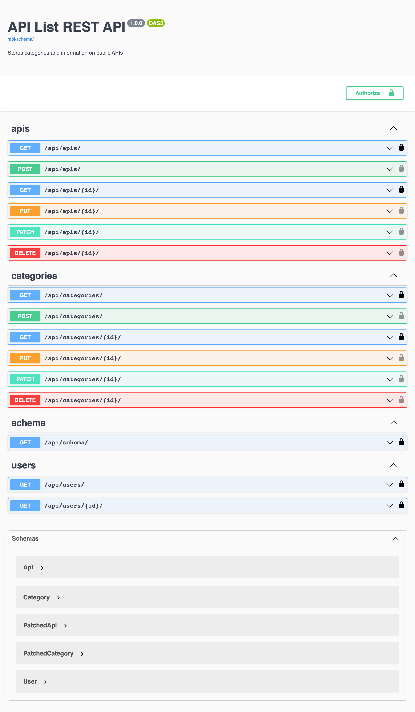

This dockerized REST API stores categories (weather, food, etc.) and information (name, description, etc.) on public APIs.
This API was built using the Django REST Framework. 
You must be the creator of the category/public API to have write permissions (please make sure you're logged in as the user who created it).  
Installation/Setup instructions (Must have Docker installed):
1. git clone https://github.com/jcho19/api_list.git
2. cd api_list
3. docker-compose up -d --build 
4. docker-compose exec web python3 manage.py migrate
5. docker-compose exec web python3 manage.py createsuperuser 

Login in as the user you created. Now, you can create categories/information on public APIs!

Below is the documentation:

